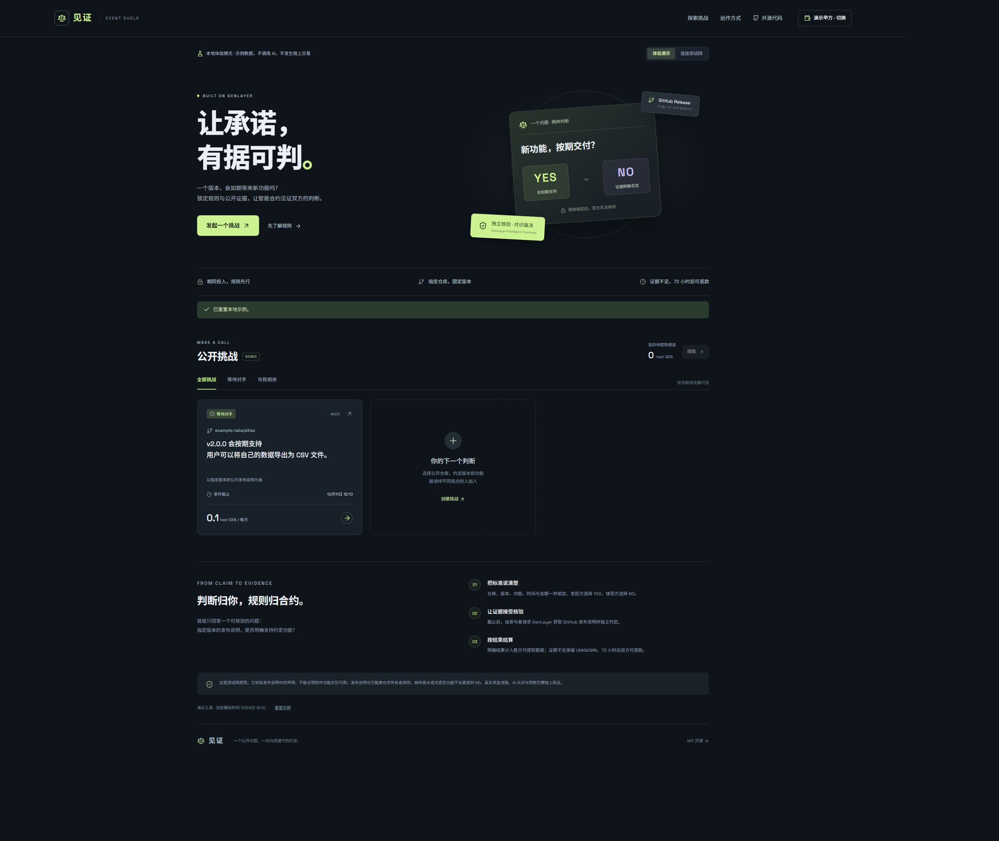

# 见证 · GenLayer Event Duels

**把项目版本的发布承诺，变成双方共同遵守、可核验的约定。**

A Chinese-first, testnet-only application for two-party GitHub release predictions. A GenLayer Intelligent Contract locks the terms and equal deposits, checks a fixed release endpoint, reaches a YES / NO / UNKNOWN verdict, and accounts for settlement or refunds.



## 当前版本

- Python 智能合约：等额投入、固定双方、公开证据、三态裁决、退款和提取额度。
- React 中文界面：创建、接受、查看证据、请求核验、取消、退款和提现入口。
- 本地演示：无需钱包，甲乙双方可切换，人工选择裁决结果，模拟时间可快进。
- Bradbury 连接：通过 `genlayer-js` 连接钱包，读取最终确认数据，估算费用、发送交易并跟踪最终确认。超时保留交易编号，不自动重发。
- MIT 开源；8 项 Python 状态转换测试、TypeScript 检查、生产构建。

**验证边界：当前未部署本项目合约，尚未验证真实钱包交易、AI 共识或链上到账。** 本地演示和单元测试都不能替代链上测试。远程 GenVM 已成功提取合约接口，但这不代表所有方法已在链上执行。

## 为什么使用 GenLayer

普通网站也能读取 GitHub、让一个模型判断并显示结果。本项目进一步把双方已经同意的条件、投入和结算状态放进合约，避免应用运营者在挑战开始后改规则或改收款人。GenLayer 用于获取公开证据和独立判断发布说明的自然语言含义。

首版刻意缩小范围：**核验发布说明中的功能声明，而不是证明代码功能可用，也不是证明整个项目真实交付。**

## 裁决规则

发起方选 YES，接受方选 NO，双方投入相同数量的 **test GEN**（每方 0.001–10）。仓库、版本标签、功能标准、接受截止及事件截止在创建后不可修改。

固定证据地址：`https://api.github.com/repos/{owner}/{repo}/releases/tags/{tag}`。不允许用户指定任意域名。

- **YES**：版本在截止前正式发布，且发布说明明确支持约定功能。
- **NO**：版本发布时间晚于截止，或按期正式发布的说明明确否定该功能 / 将其列为未来工作。
- **UNKNOWN**：版本不存在、接口不可用、缺少日期、按期发布但仍为预发布版本、说明未提及功能、内容含糊或模型输出格式不符。不把缺失证据当成 NO。

证据与判定会保存到挑战记录。明确结果将双方投入计入胜方的待提取额度。UNKNOWN 保留挑战，可在 5 分钟后重试；事件截止 72 小时后，可申请双方原额退款。上述操作都需要有人发送交易，并非后台定时自动执行。

没有人接受时，创建者可以取消；接受窗口结束后，任何直接调用的钱包都可以触发取消，额度仍归创建者。结算与取消不能重复执行。提取使用单独的 `withdraw()`，实际外部转账在最终确认后执行。

```text
OPEN ── accept_duel ──> ACTIVE ── YES / NO ──> SETTLED
 │                       │
 └── cancel_duel         ├── UNKNOWN ──> ACTIVE（可再次核验）
       ↓                 └── deadline + 72h ──> REFUNDED
   CANCELLED

终态 → 待提取额度 → withdraw → 最终确认后的外部转账
```

## 本地运行

需要 Node.js 22.12+（开发验证使用 24）和 Python 3.11+。

```sh
npm ci
npm run dev
```

在 Chrome 打开 `http://127.0.0.1:5173/`。默认进入本地演示，不请求钱包权限。示例仓库是虚构的，演示结果人工选择，数据只保存在当前浏览器。

演示步骤：

1. 查看示例挑战，或者填写表单创建自己的演示挑战。
2. 右上角切换到另一位演示参与者，再接受挑战。
3. 详情中快进到截止时间，人工选择 YES / NO / UNKNOWN。
4. 查看胜方待提取额度；或选择 UNKNOWN，再快进到可退款时间，申请双方退款。
5. 点击「提取」，验证演示额度归零。页面底部可以重置示例。

真实测试网配置见 [部署与验收步骤](docs/DEPLOYMENT.md)。可在页面填入合约地址，或将 `.env.example` 复制为 `.env` 并填写 `VITE_CONTRACT_ADDRESS`。**此变量只能放公开的合约地址，不得填写私钥。** 前端仅连接 Bradbury（4221）；Studio 模拟器地址不能混用。

## 简单验证

```sh
npm test
npm run build
npm run check:schema
```

- `npm test`：直接导入实际 Python 合约，使用最小 GenLayer 主机替身，检查权限、投入、期限、三态结算、重复提现和额度守恒。外部网络、AI、共识及转账均为替身。
- `npm run build`：TypeScript 类型检查和 Vite 生产打包。
- `npm run check:schema`：把公开合约源码发送到 Bradbury RPC，请远程 GenVM 提取接口；产物写到忽略提交的 `artifacts/`。需要网络，不会部署合约。
- 可选：安装 `genvm-lint==0.11.0` 后运行 `genvm-lint check contracts/EventDuels.py`。Windows 控制台若编码异常，设置 `PYTHONIOENCODING=utf-8`。

验证记录见 [VALIDATION.md](docs/VALIDATION.md)。GitHub Actions 对提交执行状态测试和构建。

## 目录

```text
contracts/EventDuels.py   GenLayer 智能合约
src/chain.ts             Bradbury 钱包和交易确认适配
src/model.ts             数据结构与明确标注的本地示例
src/App.tsx              中文产品界面与演示交互
tests/test_contract.py   8 项关键状态测试
scripts/check-schema.mjs 远程 GenVM 接口检查
docs/                    部署、验证与贡献提交草稿
```

## 已知限制

- GitHub 发布说明由仓库维护者控制，可编辑或删除。当前原型没有历史快照公证，也无法证明某个内容在截止前已经写入。公开来源不等于不可篡改来源。
- 自然语言条件和发布说明都是不可信输入。提示词设定了边界，但尚未验证真实模型对提示注入或含糊描述的抵抗能力。严格相等共识可能因模型分歧而失败；最终退款路径仍保留。
- 网络异常或无效 JSON 可能让一次裁决交易失败；不会据此把资金判给某一方。参与者可重试，超过退款时间可退款。
- 合约要求 `sender == origin`，只支持直接钱包调用。它不是通用智能账户兼容性保证。
- 提现会发出独立外部转账。父交易成功不应被当成钱包到账证明；需核验外部执行结果。当前原型尚未提供外部转账失败后的补偿机制。
- UI 每次写操作都估算费用。Bradbury RPC 或 SDK 版本不兼容时会报错，不会绕过费用估算继续发送。SDK 固定为 `2.0.0-rc.1`，部署前需进行真实兼容性验证。
- 单页目前展示最近 50 条挑战。无索引服务、争议申诉界面、历史证据存档或生产级审计。
- 构造函数仅接受 Studio / Studio Dev / Bradbury 链编号。不得用于真实资金或主网。

## 官方参考

- [Value transfers](https://docs.genlayer.com/developers/intelligent-contracts/features/value-transfers)
- [Transaction context](https://docs.genlayer.com/developers/intelligent-contracts/features/transaction-context)
- [Web access](https://docs.genlayer.com/developers/intelligent-contracts/features/web-access)
- [Writing data](https://docs.genlayer.com/developers/decentralized-applications/writing-data)

本项目独立开发，非 GenLayer 官方产品；开源或部署均不保证贡献积分、奖励或空投资格。
